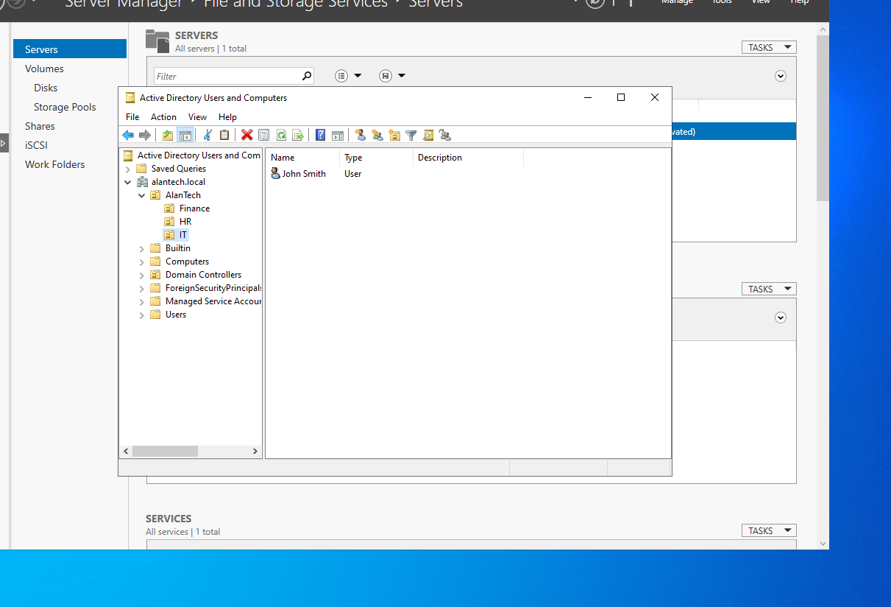
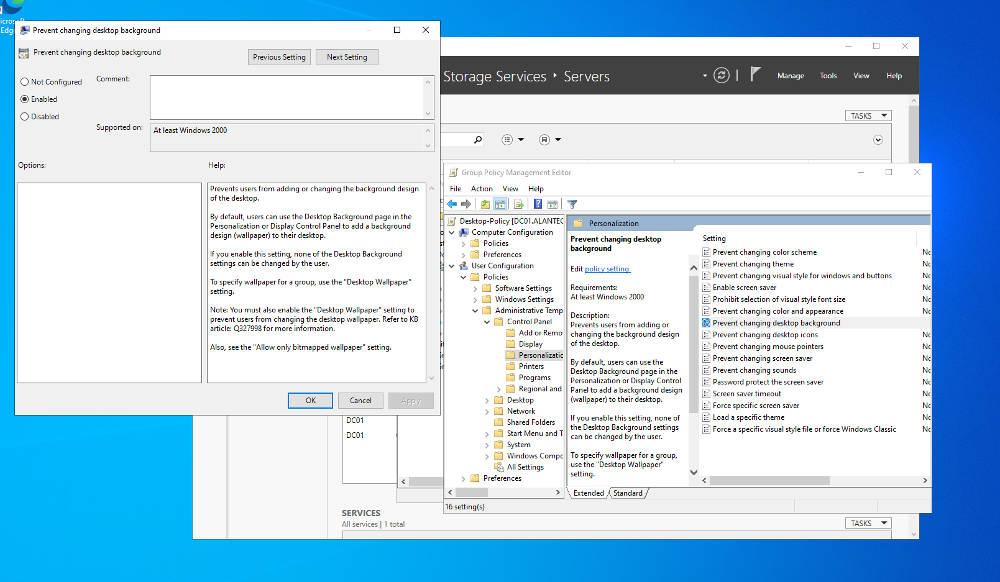
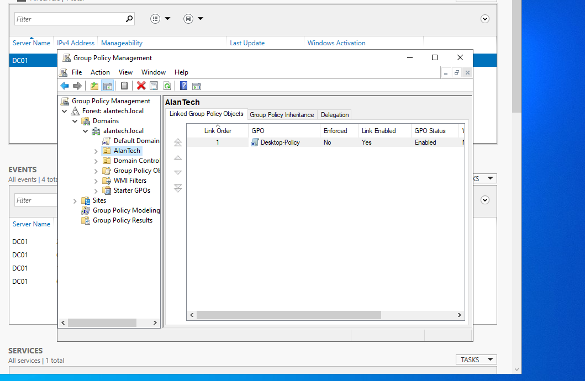

# Active Directory Home Lab

## Objective
The goal for this lab was to familiarize myself with Active Directory features like creating users within domain, adding Organizational Unit, Security Groups and Group Policy among them.

## Environment
-Oracle VirtualBox
-Windows Server 2022
-Windows 10 Client

## What I Built
I built a domain called AlanTech. Within this domain I added 3 OUs(Organizational Units) called IT, HR and Finance. For each OU I added a user with First/Lastname with standardized PW that 
followed minimum password policy.
Created an IT-Admins Security Group within the IT OU and added jsmith as a member.
For the entire AlanTech domain I added Desktop Policy so that all wallpapers are to remain unchanged via the personalization options within Windows.

## Steps Taken
My Initial steps were to establish the server via a static IP and Static DNS with a loopback IP.
Once set I renamed the Computer DC01 under the domain of alantech.local.
From there I went to active Directory Users and computers to establish groups with in the domain.
Within the alantech.local Domain I made a new OU called AlanTech, within AlanTech I made 3 OUs called Finance, HR, and IT.
After the OUs were set for each sector I added one user per their sector, Bob Johnson for Finance, Jane Doe for HR, and John Smith for IT.

Within IT I add then added a Global Security Group and added jsmith as the admin for IT.
Once all of the OUs were set, I added group policy to the entire Domain AlanTech to have Desktop-Policy so no users can change their desktop vie the personalization options inside windows.

## Key Concepts Learned
I learned that the Domain controller is the mother entity that controls the entire infrastructure. 
That OU(Organizational Units) set groups that help organization categories within the domain
Security Policy to establish Administrators within a specific OU
The group policy enforces specific settings among domain, groups or users as chosen by the Administrator 

## What I'll add next
Join the Windows 10 Client to the domain, add more OUS, Users and group policy to enforce standards among the OUs.

**Screenshots are included**
